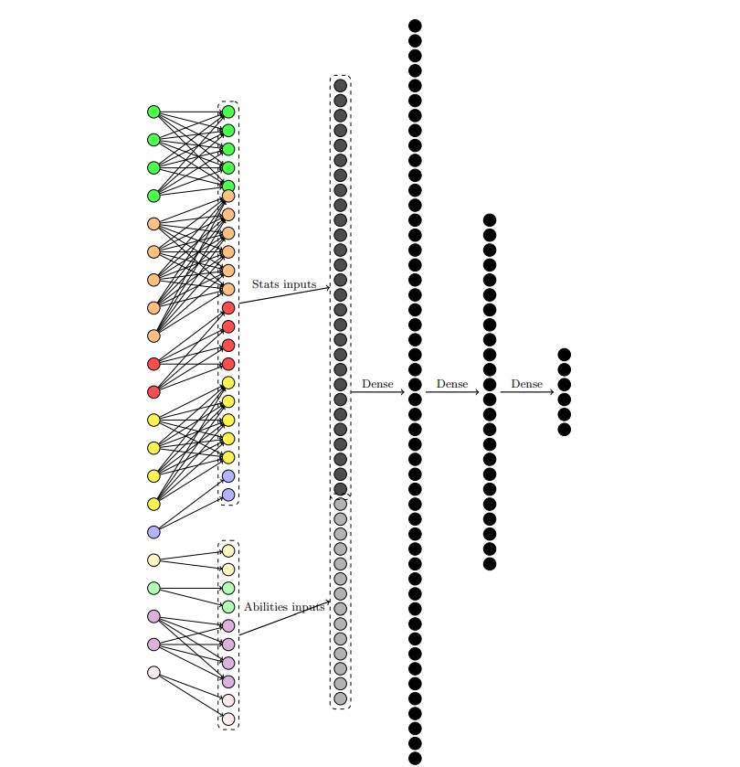
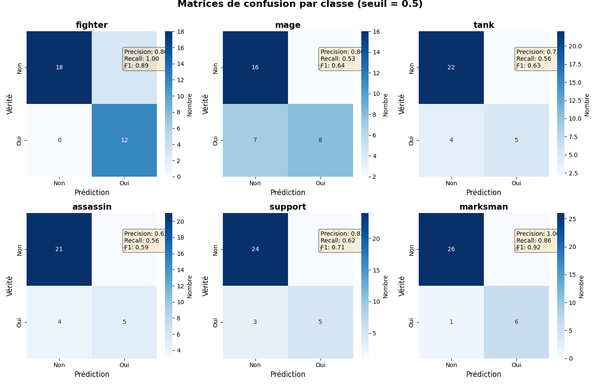

# League of Legends Classe Guesser

Notre réseau de neurones a pour but de deviner la classe des personnages (ou champions) du jeu vidéo League of Legends.

## League of Legends ?

[League of Legends](https://wiki.leagueoflegends.com/en-us/) est un jeu de type MOBA (Multiplayer Online Battle Arena) où une partie consiste en deux équipes de 5 joueurs qui s'affrontent pour détruire la base adverse. Chaque joueur choisit au début de la partie un champion, un personnage jouable, parmi les 170+ disponibles. Ces champions ont chacun une identité propre que l'on retrouve dans leurs [sorts utilisables](https://leagueoflegends.fandom.com/wiki/Champion_ability) et leurs  [statistiques](https://leagueoflegends.fandom.com/wiki/Champion_statistic).

On peut regrouper les champions dans différents groupes que l'on appelera des [classes](https://leagueoflegends.fandom.com/wiki/Champion_classes). Elles ne sont pas toujours strictement définies et un champion peut être présent dans plusieurs classe à la fois. On retrouve comme classes principales : 

* Combattant (Fighter)
* Mage
* Tank
* Assassin
* Support
* Tireur (Marksman)

Ces classes sont ce que l'on veut prédire ici. On utilise pour cela les statistiques de base, les statistiques obtenues à chaque niveau ainsi que des informations issues des compétences du personnage (dégâts, soin, mobilité, contrôle de foule...).

## Nos données

Les données des champions ont été récupérées dans un fichier JSON, ces données étant très nombreuses, nous avons donc filtré celle qui nous intéressait, notamment les statistiques. Cependant les statistiques ne font pas tout pour représenter un champion, c'est pourquoi on a aussi essayé d'extraire des informations provenant des compétences comme la possibilité de devenir invisible, la faculté à se déplacer sur la carte...

## Architecture du réseau

Nous avons fractionné nos différentes données en fonction de leurs points communs et importances afin de créer plus de sens entre elles. Ensuite elles ont été réunies en fonction de si ces données sont des statistiques sur le champion ou si elles proviennent des capacités du champion. Et enfin, elles passent dans des couches denses pour nous donner nos six outputs.

En détail nous avons :
* En vert foncé : les statistiques liées aux points de vie.
* En orange : les statistiques liées à la réduction des dégâts.
* En rouge : les statistiques liées aux dégâts physiques.
* En jaune : les statistiques liées à la vitesse d'attaque.
* En bleu clair : la distance pour attaquer.

* En jaune clair : la faculté de se donner des bonus de vitesse de déplacement.
* En vert clair : la faculté à immobiliser un adversaire.
* En violet : la faculté à se déplacer facilement sur la carte.
* En rose : la faculté à protéger un allié.

## Loss et paramètres

On utilise la fonction de loss BCEWithLogitsLoss car dans notre cas on a des champions qui appartiennent très souvent à plusieurs classes en même temps, donc cette fonction de loss nous permet d'obtenir une probabilité d'appartenir à chaque classe.

Nos données étant peu nombreuses on utilise un facteur de dropout à 0.1 afin de réduire l'overfitting de notre réseau et amélioré la généralisation.

La fonction d'activation sur les neurones est la LeakyReLu.

## Résultats obtenus

Pour analyser les résultats obtenus sur une exécution d'entrainement, on va regarder plusieurs graphiques.

Le premier comporte plusieurs matrices de confusion, une par classe : 

Pour évaluer simplement une matrice présente dans ce graphique, on peut dire que plus les diagonales sont foncées, plus la classe a été bien prédite. À l'inverse, plus les cases qui ne sont pas des diagonales sont foncées, moins la classe a été bien prédite.

En prenant comme exemple la première matrice, on a un total de 34 champion. Sur ces 34 champions, il y en avait 21 (13 + 3) qui ne sont pas de la classe "Fighter" et 12 qui le sont. On voit alors que 3 champions ont été prédit comme "Fighter" alors qu'ils ne le sont réellement pas.

On remarque que sur ces 6 classes, les "Mages" et les "Assassin" ont été les moins bien prédits. Cela s'explique par le fait que les champions de ces classes se base beaucoup plus que les autres sur les statistiques qu'apportent des objets achetés durant la partie, données que l'on ne prend pas en compte puisque beaucoup trop volumineux.

#

Ce second graphique représente sur notre dataset de test la distribution des différentes classe prédites. On ne prend pas en compte uniquement le rôle principale prédit (celui avec le plus haut taux de prédiciton) mais aussi tout ceux dépassant notre seuil de 50%. 

On retrouve à nouveau l'écart entre la réalité et la prédiction pour les "Mages", mais on observe aussi un écart assez visible pour les "Fighter". Cet écart résulte du grand nombre de champion de la classe "Fighter" présent dans le jeu, et donc très probablement d'un entrainement sur une proportion plus élevée de champions de cette classe. 

On ne peut pas vraiment analyser plus que cela les autres classes, puisque cette distribution ne nous indique pas si les rôles sont correctement prédits et associés aux bons champions.

Cependant, en le croisant avec les matrices de confusion précédentes, on peut lier le fait que les prédictions pour les "Marksman", les "Support" et les "Tank" semblent assez juste.

#

Sur ce dernier graphique, on évalue les classes ajoutés à tort ou manqués.

On remarque que le problème de surreprésentation des "Fighter" est visible ici, dans le cas des rôles ajoutés à tort ou manqués. Sur certains "Fighter" ont été ajoutés les classes "Tank" et "Assassin", et de nombreux champions ont été prédit "Fighter" à la place de leur classe réelle (ici "Support", "Assassin", "Tank" et "Mage"). On observe aussi qu'aucun fighter n'a été manqué d'être prédit.

On retrouve aussi des erreurs liées aux "Mage", où des réels champion de cette classe se sont vu attribué des classes supplémentaires ou alors la classe "Mage" à été ajouté à tort. De plus, la classe a largement été manqués dans les prédiction, ce qui est encore un indicateur de la difficultés qu'a notre modèle à prédire les champions "Mages".

## Conclusion

Pour conclure ce projet, on retrouve de bonnes prédictions pour certaines classe, mais le réseau est un peu plus confus pour d'autres. Cela s'explique par un dataset qui ne comporte pas toutes les données utilisables et possiblement nécessaire à la prédiction parfaite. Mais aussi par des champions utilisant des mécaniques uniques difficiles à évaluer, leur attribuant des statistiques sous conditions, ou encore notre seuil pour accepter une prédiction qui pourrait être différent.

En citant tout ces problèmes, on se rend compte qu'il est compliqué d'avoir un dataset parfait pour ce type de prédiction, et encore plus en sachant que ces données liées aux champions peuvent changer assez souvent entre chaque mises à jour du jeu.
